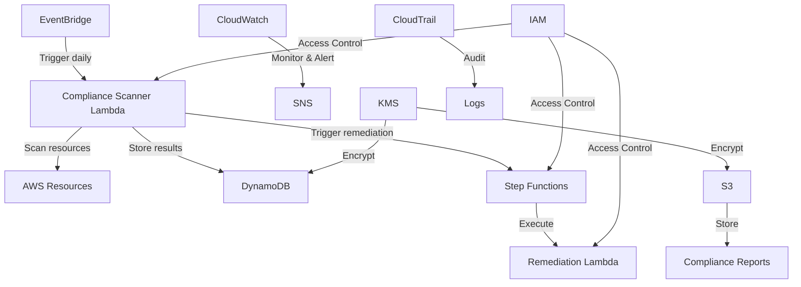

# Targeted Multi-Regulation Compliance System

Author: Dimitri Vavoulis

## Project Overview

The Targeted Multi-Regulation Compliance System is an advanced, cloud-based solution designed to automate and streamline compliance checks across multiple regulatory frameworks. This system demonstrates expertise in cloud architecture, security, and regulatory compliance, showcasing the ability to create a flexible, scalable, and highly secure compliance management platform.

The system is built entirely on AWS services, leveraging infrastructure-as-code principles through AWS CloudFormation for repeatable and consistent deployments. It's designed to meet the stringent requirements of various industries including, but not limited to, healthcare, finance, education, and government sectors.

This project is intended to be deployed in your own AWS account. There is no live demo as the system requires specific AWS resources and configurations.

## Features

- Automated daily compliance checks using pre-tagged AWS resources
- Support for multiple regulatory frameworks (e.g., HIPAA, PCI DSS, SOX, GDPR, CCPA)
- Real-time analysis of compliance status across various AWS services
- User-defined compliance rules using JSON configuration files
- Automated remediation actions for non-compliant resources
- Comprehensive reporting and alerting system
- Secure data storage with encryption at rest and in transit
- Scalable and cost-effective serverless architecture

## Supported Regulations

This system supports compliance checks and remediation for the following regulations:

1. **HIPAA** (Health Insurance Portability and Accountability Act): Protects sensitive patient health information.
2. **PCI DSS** (Payment Card Industry Data Security Standard): Ensures secure handling of credit card information.
3. **SOX** (Sarbanes-Oxley Act): Protects against fraudulent financial practices in public companies.
4. **GDPR** (General Data Protection Regulation): Strengthens data protection for EU residents.
5. **CCPA** (California Consumer Privacy Act): Enhances privacy rights for California residents.
6. **FERPA** (Family Educational Rights and Privacy Act): Protects the privacy of student education records.
7. **GLBA** (Gramm-Leach-Bliley Act): Requires financial institutions to explain information-sharing practices and protect sensitive data.
8. **FISMA** (Federal Information Security Management Act): Protects government information and operations.
9. **NIST 800-53**: Provides security control guidelines for federal information systems.
10. **ISO 27001**: Specifies requirements for information security management systems.

Each regulation is implemented with specific rules and compliance checks tailored to its requirements. Users can enable or disable checks for each regulation based on their specific compliance needs.

## Architecture



## Technical Stack

- **Infrastructure as Code**: AWS CloudFormation
- **Compute**: AWS Lambda
- **Workflow Management**: AWS Step Functions
- **Database**: AWS DynamoDB
- **Storage**: AWS S3
- **Messaging & Notifications**: AWS SNS
- **Monitoring & Logging**: AWS CloudWatch, AWS CloudTrail
- **Security**: AWS KMS, AWS IAM
- **Scheduling**: AWS EventBridge

## Key Components

1. **Compliance Scanner Lambda**: Core component that scans pre-tagged AWS resources for compliance.
2. **Remediation Orchestrator**: AWS Step Functions workflow to manage remediation actions.
3. **DynamoDB Tables**: Store compliance rules, scan results, and remediation status.
4. **S3 Buckets**: Store compliance reports and regulation JSON files.
5. **EventBridge Rules**: Schedule daily compliance scans and report generation.
6. **CloudWatch Alarms**: Monitor compliance rates and system health.
7. **SNS Topics**: Manage notifications for compliance issues and system alerts.
8. **KMS Keys**: Encrypt sensitive data at rest and in transit.
9. **IAM Roles**: Manage fine-grained access control across all components.

## Deployment

This project uses AWS CloudFormation for infrastructure as code. To deploy the system in your own AWS account:

1. Ensure you have AWS CLI configured with appropriate permissions.

2. Clone the repository:
   ```
   git clone https://github.com/dimitrivavoulisportfolio/targeted-multi-regulation-compliance-system.git
   ```

3. Navigate to the project directory:
   ```
   cd targeted-multi-regulation-compliance-system
   ```

4. Create an S3 bucket in your AWS account to host the CloudFormation templates:
   ```
   aws s3 mb s3://your-cfn-templates-bucket-name
   ```

5. Upload all the CloudFormation templates to your S3 bucket:
   ```
   aws s3 sync cloudformation/ s3://your-cfn-templates-bucket-name/compliance-system/ --exclude "*" --include "*.yaml"
   ```

6. Deploy the individual stacks in the following order:

   a. IAM Roles Stack:
   ```
   aws cloudformation create-stack --stack-name targeted-compliance-iam-roles --template-url https://your-cfn-templates-bucket-name.s3.amazonaws.com/compliance-system/iam-roles-stack.yaml --capabilities CAPABILITY_IAM CAPABILITY_NAMED_IAM
   ```

   b. KMS Keys Stack:
   ```
   aws cloudformation create-stack --stack-name targeted-compliance-kms-keys --template-url https://your-cfn-templates-bucket-name.s3.amazonaws.com/compliance-system/kms-keys-stack.yaml
   ```

   c. CloudTrail Stack:
   ```
   aws cloudformation create-stack --stack-name targeted-compliance-cloudtrail --template-url https://your-cfn-templates-bucket-name.s3.amazonaws.com/compliance-system/cloudtrail-stack.yaml --capabilities CAPABILITY_IAM
   ```

   d. CloudWatch Logs Stack:
   ```
   aws cloudformation create-stack --stack-name targeted-compliance-cloudwatch-logs --template-url https://your-cfn-templates-bucket-name.s3.amazonaws.com/compliance-system/cloudwatch-logs-stack.yaml
   ```

   e. SNS Notification Stack:
   ```
   aws cloudformation create-stack --stack-name targeted-compliance-sns --template-url https://your-cfn-templates-bucket-name.s3.amazonaws.com/compliance-system/sns-notification-stack.yaml
   ```

   f. Secondary Bucket Stack:
   ```
   aws cloudformation create-stack --stack-name targeted-compliance-secondary-bucket --template-url https://your-cfn-templates-bucket-name.s3.amazonaws.com/compliance-system/secondary-bucket-stack.yaml
   ```

   g. Primary Bucket Stack:
   ```
   aws cloudformation create-stack --stack-name targeted-compliance-primary-bucket --template-url https://your-cfn-templates-bucket-name.s3.amazonaws.com/compliance-system/primary-bucket-stack.yaml
   ```

7. Monitor the stack creation process in the AWS CloudFormation console or using the AWS CLI:
   ```
   aws cloudformation describe-stacks --stack-name targeted-compliance-primary-bucket
   ```

8. After all stacks are created successfully, upload the regulation JSON files to the primary S3 bucket:
   ```
   aws s3 sync regulations/ s3://your-primary-bucket-name/regulations/
   ```

Note: Ensure that you have the necessary permissions to create these resources in your AWS account. You may need to customize the stack names and parameters based on your specific requirements. Wait for each stack to complete before starting the next one.

## Adding New Regulations

To add support for a new regulation:

1. Create a new JSON file in the `regulations` folder, following the existing format.
2. Update the `RegulationParserLambda` to handle the new regulation type.
3. Add any necessary custom compliance checks to the `ComplianceScannerLambda`.
4. Update the reporting components to include the new regulation in summaries.

## Local Development

1. Install the AWS SAM CLI for local Lambda function testing.
2. Use the provided `samconfig.toml` file for local development settings.
3. Run unit tests using the command:
   ```
   python -m unittest discover tests
   ```

## Future Enhancements

- Integration with AWS Config for continuous compliance monitoring
- Machine learning-based predictive compliance analysis
- Support for custom, user-defined compliance rules
- Integration with popular ticketing systems for managing remediation tasks
- Mobile application for on-the-go compliance monitoring

## Contributing

Contributions are welcome! Please fork the repository and submit a pull request with your changes.

## License

This project is licensed under the MIT License - see the [LICENSE](LICENSE) file for details.

## Contact

Dimitri Vavoulis - dimitrivavoulis3@gmail.com

Project Link: [https://github.com/dimitrivavoulisportfolio/targeted-multi-regulation-compliance-system](https://github.com/dimitrivavoulisportfolio/targeted-multi-regulation-compliance-system)

---

This project was developed as part of a professional portfolio to demonstrate expertise in cloud architecture, security, and regulatory compliance in AWS environments. It showcases advanced skills in creating scalable, secure, and compliant systems using infrastructure-as-code principles. Users can deploy this system in their own AWS accounts to manage compliance across multiple regulatory frameworks.
